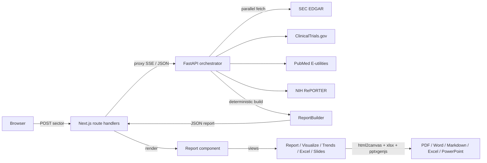

# map

**Partnership intelligence for university technology transfer.** Type a sector,
get a fully sourced report that maps public companies to overlapping research at
UNC Chapel Hill, scored and citation checked, in about a minute.

<p>
  
  
  
  
  
  
</p>

> **Disclaimer.** This is an independent project. It is **not** created by,
> affiliated with, or endorsed by UNC Chapel Hill or any of its offices. UNC
> appears only as the analytical subject of the reports the tool generates.

| | |
|---|---|
| **Web app** | https://aria-pi-frontend.vercel.app |
| **API** | https://aria-pi-api.vercel.app |
| **Status** | Live · free tier · no third-party API keys required |

---

## Table of contents

1. [What it does](#what-it-does)
2. [Key features](#key-features)
3. [Architecture](#architecture)
4. [Tech stack](#tech-stack)
5. [Repository layout](#repository-layout)
6. [Data sources](#data-sources)
7. [API reference](#api-reference)
8. [Report structure](#report-structure)
9. [Local development](#local-development)
10. [Environment variables](#environment-variables)
11. [Deployment](#deployment)
12. [Performance and limits](#performance-and-limits)
13. [Data integrity rules](#data-integrity-rules)
14. [Limitations](#limitations)
15. [Roadmap](#roadmap)
16. [License](#license)

---

## What it does

Given a sector (for example `Oncology`, `Semiconductors`, or a free-text term
like `Energy Minerals`), **map** assembles a partnership intelligence report:

1. Resolves the sector to a company set (curated top companies plus NC-based
   firms, or live SEC EDGAR full-text discovery for niche terms).
2. Pulls primary-source data per company, in parallel, from SEC EDGAR,
   ClinicalTrials.gov, PubMed, and NIH RePORTER.
3. Builds a deterministic, 7-section report plus a one-page executive summary,
   with every claim backed by at least two citable URLs.
4. Streams real progress to the browser as each company resolves, then renders
   an interactive report with charts and a live table of contents.
5. Opens the same data in a multi-view workspace: **Report**, **Visualize**
   (23 charts led by a rotating 3D connection orbit, plus network/Sankey
   diagrams), **Trends** (10-year SEC
   financial trajectories), **Excel** (18-sheet analytics workbook), and
   **Slide Deck** (speaker-noted, per-sector deck).
6. Exports to Markdown, PDF, Word, Excel (`.xlsx`), and PowerPoint (`.pptx`),
   with the on-screen visuals preserved.

Every factual claim carries its source URLs. Anything that cannot be
double-sourced is flagged for analyst review rather than guessed.

---

## Key features

- **Live progress streaming.** The backend emits Server-Sent Events as each
  company completes, so the progress UI reflects genuine work, not a timer.
- **Sector resolution.** 24 curated sectors (top 15 global + NC-based seeds)
  plus live SEC EDGAR discovery for any other term, with a clear `resolution`
  label (`curated` / `discovered` / `default`).
- **Source-verified claims.** Two-source rule, domain blocklist
  (no Wikipedia / aggregators), and a per-report verification count.
- **One-page executive summary.** Metric tiles, thesis, pie charts, a financial
  snapshot, NC context, and active UNC units, first in the report.
- **Interactive report.** Inline AMA citations, data visualizations distributed
  through the sections, and a floating scroll-spy table of contents.
- **Multi-view workspace.** A top nav (Home / Report / Visualize / Trends /
  Excel / Slide Deck) turns one report's data into five sector-customized views
  that work like a normal website.
- **Visualize.** 23 unique, per-sector charts led by a rotating 3D connection
  orbit (companies circling a central UNC node, logo-style, hover to pause),
  plus a 3D isometric scatter, a connection network, a Sankey flow, correlation
  matrix, Lorenz curve, Pareto, box plots, and a radar. Soft gradient fills,
  rounded bars, and gentle card shadows give the page a welcoming feel.
- **Trends.** Stock-style 10-year SEC financial trajectories (revenue, R&D,
  net income) showing what grew and what shrank, with CAGR and momentum, and
  thin-coverage years dropped so the latest partial fiscal year never distorts.
- **Excel workspace.** An 18-sheet analytics workbook (HHI concentration,
  correlation matrix, quartiles, CAGR, partnership-priority scores, segments)
  with on-screen analytics and live clickable worksheet previews.
- **Slide deck.** A bullet-driven, graduate-level, per-sector deck with speaker
  notes, exportable to PowerPoint.
- **High-fidelity exports.** Markdown (editable, linked), plus PDF, Word, Excel,
  and PowerPoint that capture the rendered report so they look like the web page.
- **Responsive.** Lays out cleanly on phones and tablets (iPhone / iPad): the
  nav wraps, tables scroll horizontally, and SVG charts scale to width.
- **Animated intro.** A network-graph splash that builds out from a central
  node before handing off to the app.

---

## Architecture



**Two independently deployed Vercel projects:**

- **`aria-pi-frontend`** - Next.js app. Client renders the report; server-side
  route handlers (`/api/run-pipeline`, `/api/run-pipeline-stream`) proxy to the
  backend so the browser never calls it directly and no stale cache is served.
- **`aria-pi-api`** - FastAPI app on the `@vercel/python` runtime. Resolves the
  company set, fans out to the four public data APIs concurrently within a hard
  time budget, and assembles the report deterministically.

Request lifecycle (streaming path):

```
sector ─▶ /api/run-pipeline-stream ─▶ /run-pipeline-stream
        ◀─ stage:resolved (total)
        ◀─ progress (1/N company)  ... per company as it completes
        ◀─ stage:building ─▶ stage:verifying
        ◀─ done (full report JSON)
```

If streaming is unavailable, the frontend falls back to the plain
`/run-pipeline` request plus a cosmetic progress animation, so a report always
loads.

---

## Tech stack

| Layer | Technology |
|---|---|
| Frontend | Next.js 14 (App Router), React 18, TypeScript 5 |
| Charts | Hand-rolled inline SVG (no chart library), incl. animated 3D |
| Exports | `docx`, `jspdf`, `html2canvas`, `xlsx` (SheetJS), `pptxgenjs` |
| Backend | FastAPI, Pydantic, `requests` (Python 3.12) |
| Runtime | Vercel (Next.js + `@vercel/python` serverless) |
| Data | SEC EDGAR, ClinicalTrials.gov, PubMed, NIH RePORTER |
| Optional | Anthropic Claude (legacy synthesis path; off by default) |

---

## Repository layout

```
research-graph/
├── aria-pi-frontend/                  # Next.js web app  (Vercel: aria-pi-frontend)
│   ├── public/
│   │   └── flow.html                  # standalone system data-flow diagram
│   └── src/
│       ├── app/
│       │   ├── page.tsx               # intro + search + streaming progress + report mount
│       │   ├── layout.tsx
│       │   ├── globals.css
│       │   └── api/
│       │       ├── run-pipeline/route.ts         # JSON proxy to backend
│       │       └── run-pipeline-stream/route.ts  # SSE proxy to backend
│       ├── components/
│       │   ├── Report.tsx             # report renderer, charts, TOC, summary
│       │   ├── VisualsView.tsx        # Visualize page: 23 charts + diagrams
│       │   ├── TrendsView.tsx         # Trends page: 10-year SEC trajectories
│       │   ├── Chart3D.tsx            # rotating orbit + isometric 3D scatter (SVG)
│       │   └── Intro.tsx              # animated network-graph splash
│       └── lib/
│           ├── report-analytics.ts    # HHI, correlation, quartiles, scores
│           ├── report-excel.ts        # 18-sheet .xlsx workbook builder
│           ├── report-slides.ts       # per-sector .pptx deck + speaker notes
│           └── report-export.ts       # Markdown / PDF / Word exporters
│
├── aria-pi-backend/                   # FastAPI service  (Vercel: aria-pi-api)
│   ├── api/index.py                   # Vercel ASGI entry point
│   ├── vercel.json                    # @vercel/python build config
│   └── aria_pi/
│       ├── orchestrator.py            # FastAPI app + endpoints + concurrency
│       ├── sectors.py                 # sector resolution, curated + NC seeds
│       ├── clients/
│       │   ├── sec_edgar_client.py    # facts, XBRL financials, discovery, DEF 14A
│       │   ├── clinicaltrials_client.py
│       │   ├── pubmed_client.py
│       │   ├── nih_reporter_client.py
│       │   └── claude_client.py       # optional LLM path (off unless key set)
│       ├── builders/report_builder.py # deterministic 7-section assembly
│       ├── utils/source_tagger.py     # 2-source validation + blocklist
│       ├── models/                    # Pydantic models
│       └── data/                      # curated UNC units, datasets, programs
│
└── README.md
```

> Note: top-level `src/` and `aria_pi/` directories are a stale early prototype
> and are gitignored. The shipped apps live under `aria-pi-frontend/` and
> `aria-pi-backend/`.

---

## Data sources

All free, all primary-source, no API keys required.

| Source | Provides | Endpoint |
|---|---|---|
| SEC EDGAR | Company facts, XBRL financials, filings, full-text discovery, DEF 14A proxies | `data.sec.gov`, `efts.sec.gov` |
| ClinicalTrials.gov v2 | Sponsor-matched trials, phases, collaborators | `clinicaltrials.gov/api/v2/studies` |
| PubMed (E-utilities) | UNC co-authored publications by school | `eutils.ncbi.nlm.nih.gov` |
| NIH RePORTER | Active grants mentioning a company + UNC | `api.reporter.nih.gov/v2/projects/search` |

---

## API reference

Base URL: `https://aria-pi-api.vercel.app`

### `GET /status`
Health and mode info.

### `POST /run-pipeline`
Build a full report and return it as one JSON payload.

```jsonc
// request
{ "sector": "Oncology", "companies": ["Merck", "Pfizer"] }  // companies optional

// response
{ "sector": "Oncology", "status": "COMPLETED", "data": { /* full report */ } }
```

### `POST /run-pipeline-stream`
Same pipeline, streamed as Server-Sent Events (`text/event-stream`). Frame types:

| `type` | Payload | Meaning |
|---|---|---|
| `stage` | `{ key: "resolved", total, resolution }` | company set resolved |
| `progress` | `{ done, total, company }` | one company finished fetching |
| `stage` | `{ key: "building" }` | assembling the report |
| `stage` | `{ key: "verifying" }` | source validation |
| `done` | `{ report }` | finished report object |
| `error` | `{ message }` | failure (client falls back) |

The report object carries `report_meta`, `section1_overview` … `section7`,
`references`, `_validation` (claim counts), and `_meta` (`resolution`, seeds).

---

## Report structure

Each report contains a one-page **Summary** followed by seven sections:

| # | Section | Highlights |
|---|---|---|
| Summary | Executive brief | metric tiles, thesis, pie charts, SEC snapshot, NC context, UNC units |
| 1 | Sector Overview | definition, scale, why now, NC context, UNC units; revenue & R&D charts |
| 2 | Internal Mapping | known partnerships, faculty, data assets, risk flags; alignment chart |
| 3 | Company Selection | selected vs excluded; UNC-tie and partnership-scale pie charts |
| 4 | Company Profiles | per-company facts, filings, pipeline, partnering, UNC alignment, signals, UNC alumni |
| 5 | Value Proposition | data assets, research capacity, talent, NC access, models |
| 6 | Talking Points | sourced per-company outreach points |
| 7 | References | AMA-style, de-duplicated, numbered |

---

## Workspace views

The top nav exposes five views over the same generated report. Each is
customized to the resolved sector and downloadable.

| View | What it shows | Export |
|---|---|---|
| **Report** | The sourced 7-section report + one-page summary | Markdown, PDF, Word |
| **Visualize** | 23 sector-specific charts: rotating 3D connection orbit, 3D isometric scatter, connection network, Sankey, correlation matrix, Lorenz curve, Pareto, box plots, radar, heatmap | (image capture via PDF/Word) |
| **Trends** | 10-year SEC financial trajectories (revenue, R&D, net income), CAGR, growth momentum; thin-coverage years dropped | - |
| **Excel** | 18-sheet analytics workbook with live, clickable worksheet previews and on-screen analytics | `.xlsx` |
| **Slide Deck** | Bullet-driven, graduate-level, per-sector deck with speaker notes | `.pptx` |

Analytics behind Visualize/Trends/Excel (`report-analytics.ts`): HHI
concentration, Pearson correlation matrix, quartile and five-number summaries,
CAGR, a 0-100 partnership-priority score, percentile ranks, Lorenz curve, and
segment analysis.

---

## Local development

Two services run side by side. Use two terminals.

### Backend (FastAPI)

```bash
cd aria-pi-backend
python -m venv .venv && source .venv/bin/activate
pip install -r requirements.txt
uvicorn aria_pi.orchestrator:app --reload --port 8000
# http://localhost:8000/status
```

### Frontend (Next.js)

```bash
cd aria-pi-frontend
npm install
# point the proxy at the local backend
echo 'BACKEND_API_URL=http://localhost:8000' > .env.local
npm run dev
# http://localhost:3000
```

### Tests

```bash
cd aria-pi-backend && pytest
```

---

## Environment variables

**Frontend** (server-side only; never exposed to the browser):

| Variable | Required | Description |
|---|---|---|
| `BACKEND_API_URL` | No | Backend base URL. Defaults to the live API alias. |
| `VERCEL_AUTOMATION_BYPASS_SECRET` | No | Set only if the backend project has Deployment Protection on. |

**Backend:**

| Variable | Required | Description |
|---|---|---|
| `ANTHROPIC_API_KEY` | No | Enables the optional Claude synthesis path. Omitted = deterministic builder (default). |
| `ANTHROPIC_MODEL` | No | Overrides the default Claude model when the key is set. |

---

## Deployment

Both projects deploy to Vercel from the Vercel CLI (GitHub is the source of
truth for code; pushes do not auto-deploy these two projects).

```bash
# frontend
cd aria-pi-frontend && npx vercel --prod

# backend
cd aria-pi-backend && npx vercel --prod
```

- Frontend: standard Next.js build (`aria-pi-frontend/vercel.json`).
- Backend: `@vercel/python` builds `api/index.py`, bundling `aria_pi/**`, with a
  60s function `maxDuration` (`aria-pi-backend/vercel.json`).

---

## Performance and limits

- **Concurrency budget.** Up to 22 companies are fetched in parallel under a
  hard ~44s data-collection deadline so the function stays within Vercel's 60s
  cap. Companies that miss the deadline keep an SEC-only stub; the report still
  renders.
- **Streaming cadence.** Progress events fire as each company resolves, giving
  granular "N of M analyzed" feedback.
- **Export size.** PDF/Word capture the rendered DOM as paginated page images,
  so large reports (20+ companies) can run ~70-95 pages and take ~20s to build.
  Markdown stays lightweight, fully text, and linked; Excel and PowerPoint are
  generated from data and stay small.
- **Mobile.** The UI is responsive on iPhone and iPad. The image-based PDF/Word
  capture is memory-heavy, so on a phone, large (90+ page) captures are slow and
  best done on a laptop; Markdown, Excel, and PowerPoint exports are light and
  fine on mobile. The floating table of contents is hidden below 1380px.

---

## Data integrity rules

- **Two-source rule.** Every claim needs at least two independent citable URLs
  or it is flagged for analyst review.
- **Source blocklist.** Wikipedia, aggregators, and unattributed news are
  rejected; SEC, ClinicalTrials.gov, PubMed, NIH RePORTER, and peer-reviewed
  journals are accepted.
- **Sponsor matching.** Clinical trials are matched on sponsor/collaborator
  fields, not free-text, so unrelated trials are not attributed to a company.
- **Clean typography.** Generated reports never contain em or en dashes.

---

## Limitations

- Private companies (no SEC filings) render partial profiles sourced only from
  trials, publications, and grants.
- UNC alumni detection reads DEF 14A proxy statements and public leadership
  pages; it covers board members and named executives, not every employee, and
  LinkedIn cannot be scraped (links are pre-filled searches).
- The tool removes mechanical labor; it does not replace analyst judgment.
  Reports are drafts for human verification before any outreach.

---

## Roadmap

- Internal relationship database to replace flat-file UNC seeds.
- Report versioning and diffs across time for the same sector.
- Optional selectable-text PDF mode alongside the pixel-perfect capture.
- CRM-ready structured export.

---

## License

MIT. See `LICENSE`.
